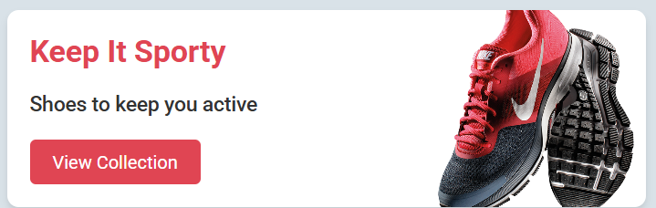

# 👟 Shoe Cards Project

Um projeto simples e elegante criado com **HTML** e **CSS**, apresentando uma coleção de *cards* de calçados — **Sporty**, **Casual** e **Formal**.  
Cada card destaca uma categoria, com título, descrição e botão de ação para visualizar a coleção correspondente.

---

## 🖼️ Demonstração

  

---

## 🚀 Funcionalidades

- Layout moderno e responsivo.  
- Três seções de cards estilizados com cores e imagens distintas.  
- Utilização de **Google Fonts** (Roboto).  
- Efeitos visuais com **sombras, bordas arredondadas** e **hover nos botões**.  

---

## 🧠 Tecnologias utilizadas

- **HTML5**
- **CSS3**
- **Google Fonts**

---

## 🛠️ Como executar o projeto

1. Faça o clone deste repositório:
   ```bash
   git clone https://github.com/seuusuario/shoe-cards-project.git
